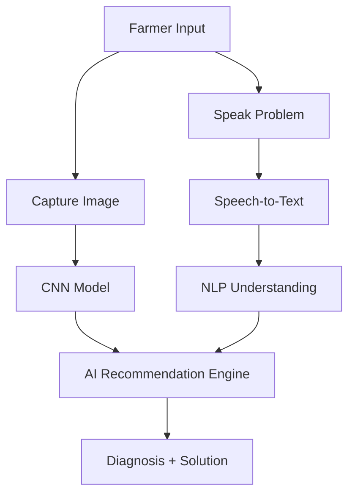

# AgriAI-Assistant
A smart AI-powered assistant for farmers that uses computer vision and voice-based NLP to detect crop issues and provide basic agricultural advice.


# 🌾 AI Helper for Farmers

**AI Helper for Farmers** is an integrated solution that leverages **Computer Vision (CV)** and **Natural Language Processing (NLP)** to help farmers quickly identify crop-related issues. The application supports **image-based disease detection** and **voice-based query interpretation**, making technology accessible to rural users through a smartphone interface.

## 📌 Project Summary:

### 🎯 Objective
To build an AI-based support system that:
- Accepts **images** of crops to detect visible diseases.
- Accepts **voice inputs** describing crop symptoms.
- Uses **CNN** for image classification and **NLP** for query understanding.
- Provides **basic solutions or suggestions** to assist farmers.
  

## 🧩 Key Features

- 📸 Image-based crop disease classification using deep learning  
- 🎤 Voice-based farmer query interpretation  
- 💡 Multi-modal input fusion: combines image + text/voice inputs  
- 📱 Friendly mobile-first interface (can run via app or web)  
- 🌐 Works offline or with minimal connectivity using lightweight models  
- 🔍 Provides clear, actionable recommendations to non-technical users  


## 🛠️ Technology Stack

| Component            | Technology                        |
|----------------------|------------------------------------|
| Image Classification | TensorFlow / Keras (CNN)           |
| NLP Pipeline          | SpeechRecognition, spaCy / NLTK    |
| Voice to Text         | PyDub + Google Speech API (offline optional) |
| Interface             | Streamlit / Flask / Android App    |
| Development Tools     | Google Colab, Jupyter Notebook     |

---

## 🧪 Model Performance

- **Validation Accuracy**: ~90% (CNN model)  
- **Voice Query Understanding**: >85% accuracy on synthetic voice-text samples  
- **Confusion Matrix, Accuracy/Loss graphs**: Available in notebook  

---

## 🗂 Dataset

### 🖼 Image Dataset
- Source: [PlantVillage Dataset](https://github.com/spMohanty/PlantVillage-Dataset)  
- Classes: Multiple plant diseases (subset: balanced classes only)  
- Format: JPEG images organized in class-wise folders  
- Preprocessing:  
  - Resized to 224x224 pixels  
  - Rescaled pixel values to [0, 1]  
  - Augmented with rotation, flipping, zoom  

### 🔊 Voice & Text Dataset
- Synthetic queries based on real-world farming problems  
- Example: “The leaves are curling and turning yellow”  
- Processed with:  
  - Speech-to-Text conversion  
  - Tokenization and entity recognition
     
    
---


## 🔁 System Architecture



---

## 🧪 Training Details

- Model: Sequential CNN  
- Layers: Conv2D, MaxPooling, Dropout, Flatten, Dense  
- Loss: Categorical Crossentropy  
- Optimizer: Adam  
- Epochs: 10  
- Train/Test Split: 80:20

---

## 📂 Directory Structure

```
AI_Helper_For_Farmers/
├── app/
│   └── streamlit_app.py
├── data/
│   ├── images/
│   └── voice_samples/
├── model/
│   ├── crop_disease_cnn.h5
│   └── tf_lite_model.tflite
├── nlp/
│   ├── nlp_pipeline.py
│   └── intents.json
├── notebooks/
│   └── training.ipynb
├── scripts/
│   ├── preprocess_images.py
│   └── voice_to_text.py
├── assets/
│   ├── figures/
│   └── ui_mockups/
├── tests/
│   └── test_nlp.py
├── requirements.txt
├── README.md
├── LICENSE
└── .gitignore
```

---
## 🧪 How to Use

### 🔧 Installation

```bash
git clone https://github.com/your-username/ai-helper-for-farmers.git
cd ai-helper-for-farmers
pip install -r requirements.txt
```

### ▶️ Running the App

```bash
streamlit run app/streamlit_app.py
```

---

## 📸 Sample Inputs

| Input Type | Example                                | Output                          |
|------------|----------------------------------------|----------------------------------|
| Image      | Leaf with yellowing and curling edges | Suggests nutrient deficiency    |
| Voice      | "Leaves have black dots on the edges" | Fungal infection + care advice  |

---
## 🎯 Future Work

- Add multilingual support (regional languages)
- Use real farmer voice dataset
- Deploy as offline mobile app (TFLite)
- Add expert consultation module

---

## 🎓 Academic Use

Perfect for:
- AI + Agriculture applications
- CV + NLP integration projects
  

---

## 🤝 Acknowledgements

- [PlantVillage Dataset](https://github.com/spMohanty/PlantVillage-Dataset)
- TensorFlow / Keras / spaCy / NLTK / Streamlit
  
---

## 📬 Contact

**Developer:** Anu  
   
🐙 [GitHub](https://github.com/Anu9866/AgriAI-Assistant)


